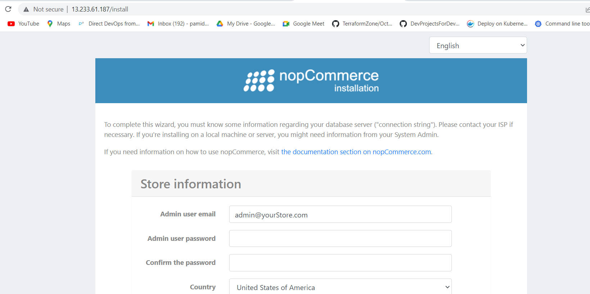

nop_installing_steps:
--------------------
* Try to install nop on ubuntu follow this link to install nopCommerce
   * [refer]https://docs.nopcommerce.com/en/installation-and-upgrading/installing-nopcommerce/installing-on-linux.html
* first we need dotnet to run this appiction so first install dotnet
* to install dotnet use this commands
  
```bash
wget https://packages.microsoft.com/config/ubuntu/20.04/packages-microsoft-prod.deb -O package
dpkg -i packages-microsoft-prod.deb

```
* install steps for nop
```
sudo apt-get update
sudo apt-get install -y apt-transport-https aspnetcore-runtime-7.0

```
* next you want install nginx 
```
sudo apt install nginx
sudo systemctl start nginx

```
* next we have to create default file to get reverse proxy service and also we want to place that default file in some spefic path

```
/etc/nginx/sites-available/default

```
* next create one directory 
```
mkdir /var/www/nopCommerce
* next move to that folder and download some file use this commnads
```
cd /var/www/nopCommerce

sudo wget https://github.com/nopSolutions/nopCommerce/releases/download/release-4.60.1/nopCommerce_4.60.1_NoSource_linux_x64.zip

sudo apt-get install unzip

sudo unzip nopCommerce_4.60.1_NoSource_linux_x64.zip
```
* Create couple directories to run nopCommerce
```
sudo mkdir bin
sudo mkdir logs
```
Change the file permissions
```
cd ..
sudo chgrp -R www-data nopCommerce/
sudo chown -R www-data nopCommerce/
```
* creating nop service file
```
[Unit]
Description=Example nopCommerce app running on Xubuntu

[Service]
WorkingDirectory=/var/www/nopCommerce
ExecStart=/usr/bin/dotnet /var/www/nopCommerce/Nop.Web.dll
Restart=always
# Restart service after 10 seconds if the dotnet service crashes:
RestartSec=10
KillSignal=SIGINT
SyslogIdentifier=nopCommerce-example
User=www-data
Environment=ASPNETCORE_ENVIRONMENT=Production
Environment=DOTNET_PRINT_TELEMETRY_MESSAGE=false

[Install]
WantedBy=multi-user.target

```
* we have to place this file into some spefic path
/etc/systemd/system/nopCommerce.service

* Start the service

```
sudo systemctl start nopCommerce.service

```
* Restart the nginx server

```
sudo systemctl restart nginx

```
then this page will appaer


